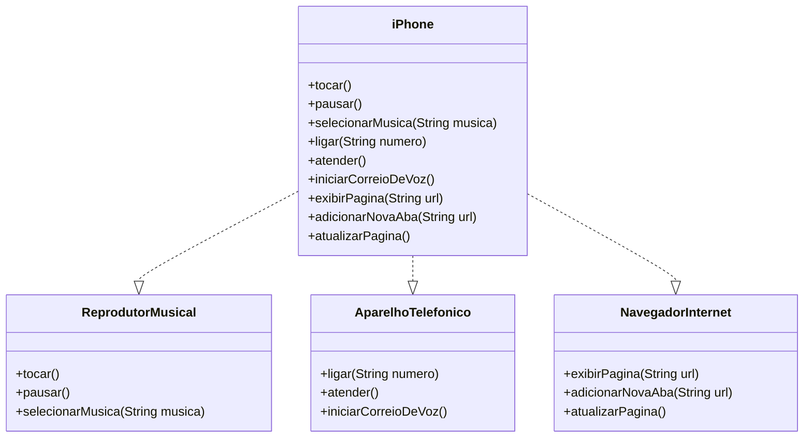

# Simulador de iPhone

Este projeto é um desafio da DIO, e simula as funcionalidades básicas de um iPhone, implementando as interfaces para Reprodutor Musical, Aparelho Telefônico e Navegador de Internet. O objetivo deste projeto é demonstrar o uso de Programação Orientada a Objetos (POO) e a implementação de interfaces em Java.

## Funcionalidades

- **Reprodutor Musical**: Permite tocar, pausar e selecionar músicas.
- **Aparelho Telefônico**: Permite fazer ligações, atender chamadas e iniciar o correio de voz.
- **Navegador de Internet**: Permite exibir páginas da web, adicionar novas abas e atualizar páginas.

## Diagrama de Classes UML

O diagrama abaixo ilustra a relação entre as interfaces e a classe `iPhone`.

## Executando o Projeto

- Abra um terminal e navegue até o diretório **\bin**, onde os arquivos **.java** estão salvos.

- Execute **java IPhone** para iniciar o programa e testar as funcionalidades.